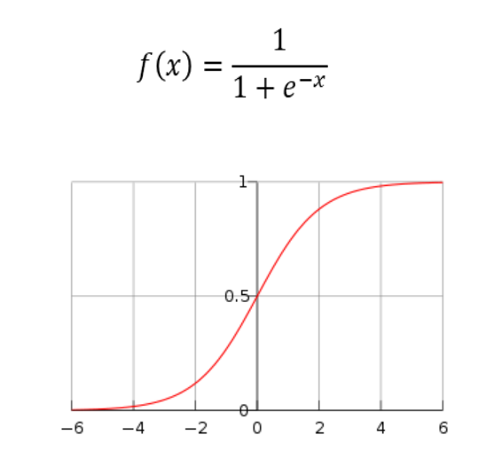

# Regresión logística

**¿Cómo funciona?**

La regresión logística es un algoritmo de clasificación que se utiliza para predecir la probabilidad de un resultado binario (por ejemplo, sí/no, verdadero/falso, 0/1). A diferencia de la regresión lineal, la regresión logística no predice directamente la variable dependiente, sino la probabilidad de que la variable dependiente pertenezca a una categoría específica.

Utiliza una función sigmoide (también conocida como función logística) para mapear la salida de una ecuación lineal a un rango entre 0 y 1, que se interpreta como una probabilidad.

**¿Cómo funciona?**

La regresión logística es un algoritmo de clasificación que se utiliza para predecir la probabilidad de un resultado binario (por ejemplo, sí/no, verdadero/falso, 0/1). A diferencia de la regresión lineal, la regresión logística no predice directamente la variable dependiente, sino la probabilidad de que la variable dependiente pertenezca a una categoría específica.

Utiliza una función sigmoide (también conocida como función logística) para mapear la salida de una ecuación lineal a un rango entre 0 y 1, que se interpreta como una probabilidad.

  

**Matemática involucrada:**

La ecuación de la regresión logística se basa en la función sigmoide:

P(y=1∣x)=1+e−(β0+β1x1+β2x2+⋯+βnxn)1

Donde:

- P(y=1∣x) es la probabilidad de que la variable dependiente y sea igual a 1 (pertenezca a la clase positiva) dado el conjunto de variables independientes x.
- e es la base del logaritmo natural.
- β0,β1,…,βn son los coeficientes del modelo.
- x1,x2,…,xn son las variables independientes.

El término dentro de la función sigmoide, β0+β1x1+β2x2+⋯+βnxn, es la misma combinación lineal que en la regresión lineal. La función sigmoide transforma esta salida lineal en una probabilidad entre 0 y 1.

El objetivo es estimar los coeficientes β0,β1,…,βn que mejor se ajusten a los datos de entrenamiento. Esto se hace típicamente utilizando la técnica de máxima verosimilitud (Maximum Likelihood Estimation - MLE), que busca maximizar la probabilidad de observar los datos dados los parámetros del modelo.

### **Parámetros:**

Al igual que en la regresión lineal, los parámetros de la regresión logística son los coeficientes β0,β1,…,βn.

### **Hiperparámetros:**

Similar a la regresión lineal básica, la regresión logística tiene pocos hiperparámetros en su forma más simple. Sin embargo, las decisiones sobre la inclusión de términos de interacción, la transformación de variables y la elección del algoritmo de optimización (por ejemplo, diferentes solvers como 'liblinear', 'lbfgs', 'newton-cg', 'sag', 'saga' en scikit-learn) pueden considerarse hiperparámetros. Además, la aplicación de técnicas de regularización (L1 o L2) introduce un parámetro de penalización.

### **Casos de uso:**

- **Detección de spam:** Clasificar correos electrónicos como spam o no spam basándose en las características del correo electrónico.
- **Diagnóstico médico:** Predecir la probabilidad de que un paciente tenga una determinada enfermedad basándose en sus síntomas y resultados de pruebas.
- **Predicción de abandono de clientes (Churn):** Estimar la probabilidad de que un cliente deje de utilizar un servicio.
- **Evaluación de riesgo crediticio:** Determinar la probabilidad de que un solicitante de préstamo incumpla con sus pagos.

### **¿Cómo difiere de otros modelos parecidos?**

- **Regresión Lineal:** La regresión logística se utiliza para clasificación, mientras que la regresión lineal se utiliza para predicción de valores continuos. La regresión logística utiliza la función sigmoide para modelar probabilidades, mientras que la regresión lineal modela directamente la variable dependiente.
- **Otros modelos de clasificación (SVM, Árboles de Decisión, Redes Neuronales):** La regresión logística es un modelo lineal para la clasificación. Otros modelos pueden capturar relaciones no lineales más complejas en los datos. Sin embargo, la regresión logística es a menudo un buen punto de partida debido a su interpretabilidad y eficiencia.

### **Más información relevante:**

- **Interpretación de los coeficientes:** Los coeficientes en la regresión logística representan el cambio en el logaritmo de las odds (la razón de la probabilidad de éxito sobre la probabilidad de fracaso) por cada unidad de cambio en la variable predictora. Exponenciando el coeficiente (exp(βi)) se obtiene el odd ratio, que indica cómo cambian las odds por cada unidad de aumento en la variable predictora.
- **Evaluación del modelo:** El rendimiento de un modelo de regresión logística se evalúa utilizando métricas como la exactitud (accuracy), la precisión (precision), el recall, la puntuación F1, la curva ROC y el área bajo la curva (AUC).
- **Manejo de variables categóricas:** Las variables categóricas deben codificarse (por ejemplo, utilizando one-hot encoding) antes de ser utilizadas en un modelo de regresión logística.
- **Multicolinealidad:** Al igual que en la regresión lineal, la multicolinealidad (alta correlación entre las variables predictoras) puede afectar la estabilidad e interpretabilidad de los coeficientes en la regresión logística.

**Matemática involucrada:**

La ecuación de la regresión logística se basa en la función sigmoide:

P(y=1∣x)=1+e−(β0+β1x1+β2x2+⋯+βnxn)1

Donde:

- P(y=1∣x) es la probabilidad de que la variable dependiente y sea igual a 1 (pertenezca a la clase positiva) dado el conjunto de variables independientes x.
- e es la base del logaritmo natural.
- β0,β1,…,βn son los coeficientes del modelo.
- x1,x2,…,xn son las variables independientes.

El término dentro de la función sigmoide, β0+β1x1+β2x2+⋯+βnxn, es la misma combinación lineal que en la regresión lineal. La función sigmoide transforma esta salida lineal en una probabilidad entre 0 y 1.

El objetivo es estimar los coeficientes β0,β1,…,βn que mejor se ajusten a los datos de entrenamiento. Esto se hace típicamente utilizando la técnica de máxima verosimilitud (Maximum Likelihood Estimation - MLE), que busca maximizar la probabilidad de observar los datos dados los parámetros del modelo.

### **Parámetros:**

Al igual que en la regresión lineal, los parámetros de la regresión logística son los coeficientes β0,β1,…,βn.

### **Hiperparámetros:**

Similar a la regresión lineal básica, la regresión logística tiene pocos hiperparámetros en su forma más simple. Sin embargo, las decisiones sobre la inclusión de términos de interacción, la transformación de variables y la elección del algoritmo de optimización (por ejemplo, diferentes solvers como 'liblinear', 'lbfgs', 'newton-cg', 'sag', 'saga' en scikit-learn) pueden considerarse hiperparámetros. Además, la aplicación de técnicas de regularización (L1 o L2) introduce un parámetro de penalización.

### **Casos de uso:**

- **Detección de spam:** Clasificar correos electrónicos como spam o no spam basándose en las características del correo electrónico.
- **Diagnóstico médico:** Predecir la probabilidad de que un paciente tenga una determinada enfermedad basándose en sus síntomas y resultados de pruebas.
- **Predicción de abandono de clientes (Churn):** Estimar la probabilidad de que un cliente deje de utilizar un servicio.
- **Evaluación de riesgo crediticio:** Determinar la probabilidad de que un solicitante de préstamo incumpla con sus pagos.

### **¿Cómo difiere de otros modelos parecidos?**

- **Regresión Lineal:** La regresión logística se utiliza para clasificación, mientras que la regresión lineal se utiliza para predicción de valores continuos. La regresión logística utiliza la función sigmoide para modelar probabilidades, mientras que la regresión lineal modela directamente la variable dependiente.
- **Otros modelos de clasificación (SVM, Árboles de Decisión, Redes Neuronales):** La regresión logística es un modelo lineal para la clasificación. Otros modelos pueden capturar relaciones no lineales más complejas en los datos. Sin embargo, la regresión logística es a menudo un buen punto de partida debido a su interpretabilidad y eficiencia.

### **Más información relevante:**

- **Interpretación de los coeficientes:** Los coeficientes en la regresión logística representan el cambio en el logaritmo de las odds (la razón de la probabilidad de éxito sobre la probabilidad de fracaso) por cada unidad de cambio en la variable predictora. Exponenciando el coeficiente (exp(βi)) se obtiene el odd ratio, que indica cómo cambian las odds por cada unidad de aumento en la variable predictora.
- **Evaluación del modelo:** El rendimiento de un modelo de regresión logística se evalúa utilizando métricas como la exactitud (accuracy), la precisión (precision), el recall, la puntuación F1, la curva ROC y el área bajo la curva (AUC).
- **Manejo de variables categóricas:** Las variables categóricas deben codificarse (por ejemplo, utilizando one-hot encoding) antes de ser utilizadas en un modelo de regresión logística.
- **Multicolinealidad:** Al igual que en la regresión lineal, la multicolinealidad (alta correlación entre las variables predictoras) puede afectar la estabilidad e interpretabilidad de los coeficientes en la regresión logística.